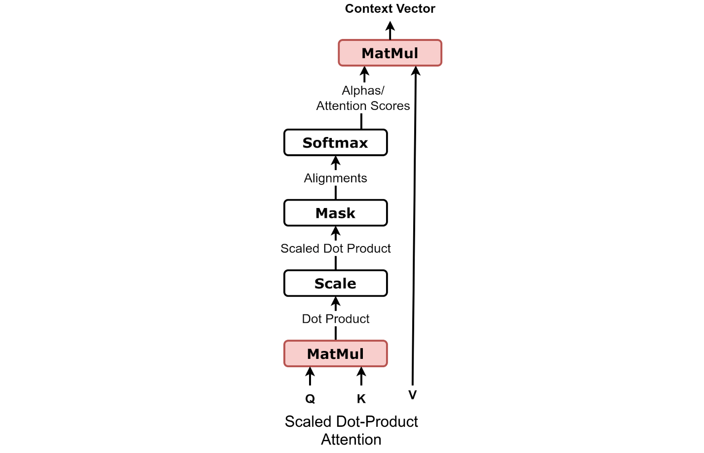
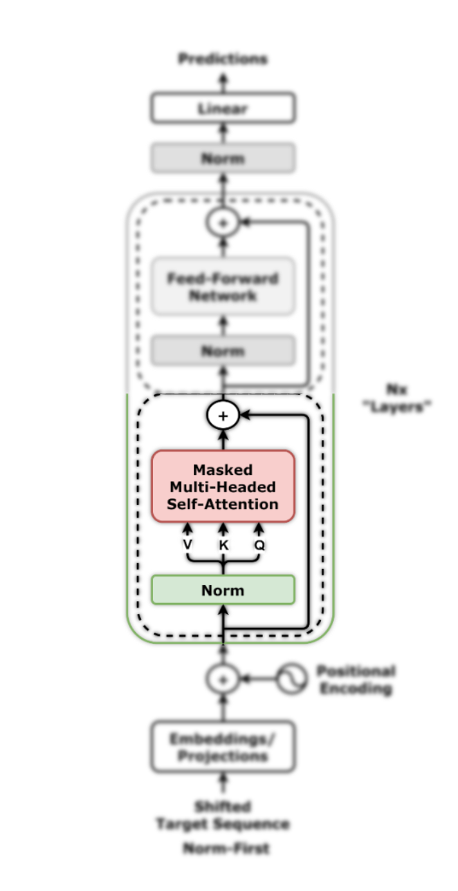
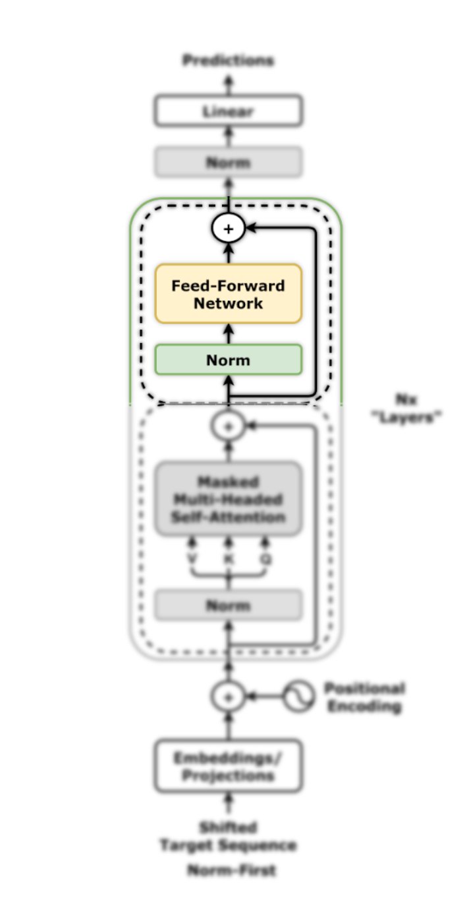
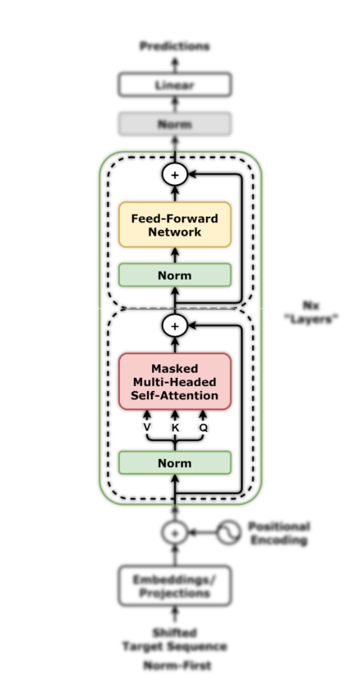
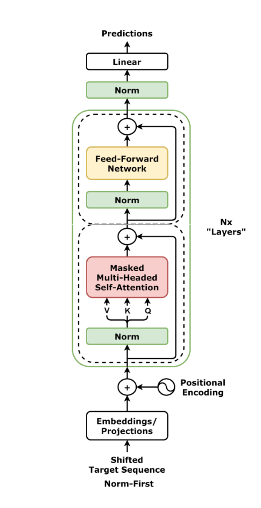

# HW4 Handout


## 📓 Notebooks & Core Files

This should be the directory structure from your project root directory:

```
.
├── HW4P1_nb.ipynb
├── HW4P2_nb.ipynb
├── README.md
├── hw4lib/
├── mytorch/
└── hw4_data/


```

## HW4P1: Autoregressive Language Modeling with a Causal Transformer Decoder

Welcome to HW4P1! In this assignment, you will build almost all the components of a **decoder-only transformer** model (think GPT-2!) from scratch, train it on an autoregressive language modeling task, and use it to generate text. This will be a monumental task, but we promise it will be a rewarding one. We will break down this task into several smaller tasks, each of which will build on the last. Also, a lot of the components you will implement will be reusable in HW4P2. We will begin with an overview of the training objective, evaluation and inference before breaking down the implementation into several smaller tasks.

**WARNING**: This assignment is designed to be significantly more challenging than previous assignments. We recommend you start early and reach out on Piazza if you get stuck.

### Training Objective

We aim to train a **decoder-only transformer** to model the probability of a sequence of tokens autoregressively:

$$
P(x_{1}, ..., x_{N}) = \prod_{t=1}^{N} P(x_{t} | x_{1}, ..., x_{t-1})
$$

where $x_1, ..., x_N$ represents a sequence of tokens, and each conditional probability $P(x_t | x_1, ..., x_{t-1})$ is modeled using our transformer.

---

#### Training with Self-Supervision
We train the model using a large corpus of **unlabeled text**. Given a token sequence $x_1, ..., x_N$, the target is $x_{N+1}$, the next token in the sequence. Instead of processing each training sample independently, we train on **entire sequences in parallel**, where each token serves as both an input and a target.

###### **Example**
For the sentence:

> "`<SOS>` I swam across the river `<EOS>`"

- **Input:** \["`<SOS>`", "I", "swam", "across", "the"\] → **Target:** "river"
- **Input:** \["I", "swam", "across", "the", "river"\] → **Target:** "`<EOS>`"
- …and so on.

This **parallel processing improves efficiency** but requires mechanisms to prevent **cheating** (i.e., directly copying the next token).

#### Preventing Information Leakage
To ensure the model **does not access future tokens during training**, we apply:
1. **Start and End Tokens:**  
   - Prepend a special **start-of-sequence** token $ \langle \text{SOS} \rangle $ to the **input sequence**.
   - Append an **end-of-sequence** token $ \langle \text{EOS} \rangle $ to the **target sequence**.  
   - This shifts the input sequence **rightward**, aligning it with the target.

2. **Causal Masking:**  
   - In the transformer's **self-attention layers**, a **causal mask** is applied to ensure each token **only attends to past tokens**.
   - This prevents information from future tokens from leaking into the model.

3. **Padding and Pad Masks:**  
   - Since GPUs require **fixed-length tensors**, shorter sequences are **padded** using a special $ \langle \text{PAD} \rangle $ token.
   - A **pad mask** ensures that these padded positions do not influence predictions.

---

#### Training Process
##### 1. Token Embedding
Each token in the input sequence is converted into a sequence of $D$-dimensional embedding vectors using the model's embedding layer:

$$
x_1, ..., x_N \in \{1, ..., K\} \rightarrow E(x_1), ..., E(x_N) \in \mathbb{R}^{D}
$$

where:
- $K$ is the vocabulary size.
- $E(x_i)$ represents the learned embedding for token $x_i$.
- Implemented using PyTorch’s `nn.Embedding`.

##### 2. Transformer Processing
The sequence of **D-dimensional embeddings** is injected with **positional encodings** and passed through **decoder layers**, applying **self-attention, feedforward transformations, and masking**.

##### 3. Output Logits
The model produces a sequence of hidden states $ \tilde{x}_1, ..., \tilde{x}_N $, each of dimensionality $ D $.

To obtain logits over the vocabulary ($K$), we apply a **final linear transformation**:

$$
Y = X W^{(p)}
$$

where:
- $W^{(p)} \in \mathbb{R}^{D \times K}$ is the **projection matrix**.
- $X \in \mathbb{R}^{N \times D}$ is the model's hidden state output.
- $Y \in \mathbb{R}^{N \times K}$ are **logits**, representing unnormalized scores over the vocabulary.

###### 4. Softmax and Cross-Entropy Loss
We apply the **softmax function** to obtain probabilities:

$$
P(x_t | x_1, ..., x_{t-1}) = \text{softmax}(Y_t)
$$

However, **we do not explicitly compute softmax in the code**. Instead, PyTorch’s `nn.CrossEntropyLoss`:
- Takes the **raw logits** $Y$ and the **ground-truth token sequence**.
- **Internally applies softmax** before computing the loss.

#### Summary of Key Steps
1. **Prepare input-target pairs** by shifting sequences and applying **causal and pad masking**.
2. Convert token sequences into embeddings.
3. Inject embeddings with **positional encodings**.
4. Process embeddings using **decoder-only transformer layers**.
5. Apply a **final linear layer** to obtain logits of shape $(N, K)$.
6. Compute **cross-entropy loss** using raw logits and target tokens.

This training approach **maximizes the likelihood of the training data** and enables the model to learn meaningful token dependencies in an **autoregressive manner**.

### Evaluation: Measuring Language Model Performance

To evaluate the quality of our **decoder-only transformer**, we need a metric that captures how well the model predicts the next token in a sequence. One intuitive way to do this is by measuring how **surprising** the model finds a sequence of text.

#### Perplexity: How Confused Is Our Model?

A good language model should assign high probability to reasonable continuations of a sentence and low probability to nonsensical ones. Consider the phrase:  

> _"It is raining..."_  

Different language models might predict:  

1. _"It is raining outside."_ ✅ (Logical and grammatically correct)  
2. _"It is raining banana tree."_ 🤨 (Strange, but at least valid words)  
3. _"It is raining piouw;kcj pwepoiut."_ ❌ (Total gibberish)  

The first continuation is the best, as it aligns with real-world language patterns. A well-trained model should maximize the likelihood of producing sensible text.  

#### Cross-Entropy and Perplexity

We formally evaluate our model using **cross-entropy loss**, which measures how well it predicts each token in a sequence. Given a sequence of tokens $ x_1, \dots, x_N $, the cross-entropy loss is:  

$$
\mathcal{L} = - \frac{1}{N} \sum_{t=1}^{N} \log P(x_t | x_1, ..., x_{t-1})
$$  

where:  
- $ P(x_t | x_1, ..., x_{t-1}) $ is the probability assigned by the model to the correct next token.  

Instead of reporting cross-entropy directly, NLP researchers often use **perplexity (PPL)**, which is simply the exponentiation of the cross-entropy loss:  

$$
\text{Perplexity} = e^{\mathcal{L}}
$$  

Intuitively, perplexity represents the **effective number of choices** the model considers at each step:  

- **Perfect model:** Always assigns probability 1 to the correct token → **Perplexity = 1**  
- **Worst model:** Predicts the correct token with probability 0 → **Perplexity = ∞**  
- **Baseline:** Uniform probability over all tokens in the vocabulary → **Perplexity ≈ Vocabulary Size**  

You will be reporting **per-character perplexity** instead of per-token perplexity. This ensures consistency across different vocabulary sizes and sequence lengths.

### Generation: Sampling Strategies

After training the model, we can use it to generate text! When generating sequences, a transformer decoder outputs a probability distribution for the next token. To extend the sequence, a particular token must be chosen based on these probabilities. Here are a few sampling strategies:

#### 1. **Greedy Search**  
Greedy search selects the token with the highest probability at each step. While efficient with a complexity of $O(KN)$, it is deterministic and can lead to suboptimal sequences, as it doesn't maximize the joint distribution over all tokens.

#### 2. **Beam Search**  
Beam search maintains $B$ hypotheses and explores multiple token sequences by considering the top $B$ most probable tokens at each step. The most probable sequence is chosen after pruning. Its complexity is $O(BKN)$, but it can be computationally expensive for large models.

#### 3. **Top-K Sampling**  
Top-K sampling samples from the top $K$ most probable tokens at each step, allowing for more diversity compared to greedy search. It helps prevent the generation of nonsensical sequences while controlling the exploration of less likely tokens.

#### 4. **Nucleus Sampling (Top-p Sampling)**  
Nucleus sampling selects tokens from a cumulative distribution of the top $K$ tokens, stopping once a threshold $p$ is reached. This strategy focuses on the most probable tokens while maintaining flexibility for diverse outputs.

#### 5. **Temperature Sampling**  
Temperature scaling softens the probabilities by introducing a temperature parameter $T$ in the softmax function. A temperature of $T = 0$ results in greedy search, while $T = 1$ recovers the standard softmax. As $T$ increases, the distribution becomes more uniform, encouraging more exploration of less probable tokens.

Each of these strategies can be used depending on the trade-off between diversity and determinism, and the goal of the generated sequences.

  
### Tasks:

The following sections will now describe the tasks you will need to complete for this assignment. Let us begin with an overview:

- Task 1: MyTorch Implementations
  - Modify your `Linear` implementation from HW1P1 to support arbitrary dimensions
  - Implement a generic `Softmax` class that supports arbitrary dimensions
  - Implement the `ScaledDotProductAttention` class
  - Implement the `MultiHeadAttention` class

- Task 2: Language Modelling with a Causal Transformer Decoder
  - Implement the `LMDataset` class to load and preprocess the data
  - Implement the `CausalMask` and `PadMask` functions to handle masking
  - Implement the `PositionalEncoding` class to handle positional encodings
  - Implement Transformer sublayers: `SelfAttentionLayer` and `FeedForwardLayer`, components of the `SelfAttentionDecoderLayer`
  - Implement Transformer layer: `SelfAttentionDecoderLayer`
  - Implement the `DecoderOnlyTransformer` class
  - Implement `Greedy` decoding
  - Implement parts of `LMTrainer`
  - Train the model on the dataset
  - Achieve a per-character perplexity of less than **3.5** on the test set
  - Generate some sample text using the model


> `NOTE`: All implementations have detailed specification, implementation details, and hints in their respective source files. Make sure to read all the comments and docstrings in their entirety to understand the implementation details!

### Task 1: MyTorch Implementation

In `HW4P1` and `HW4P2`, you will build and train Transformer models using PyTorch’s `nn.MultiHeadAttention`. To deepen your understanding of its internals, you will also implement a custom `MultiHeadAttention` module from scratch as part of your `mytorch` library, designed to closely match PyTorch’s interface.

We recommend developing the components incrementally and using the command provided in the `MyTorch Implementations` cell of `HW4P1_nb.ipynb` to test your implementation.

#### 1.1 Linear Layer (`mytorch/nn/linear.py`)
In HW1P1, you implemented a `Linear` layer that took a 2D array of shape `(N, C)` and computed the linear transformation of each element over the `C` classes. In this assignment, In order to be able to use the `Linear` layer in the `MultiHeadAttention` class, you will implement a more generic `Linear` class in `mytorch/nn/linear.py`, where the number of dimensions of the input can be arbitrary. The implementation will largely be the same as HW1P1 but with a few key differences. Feel free to use your HW1P1 implementation as a reference.

##### 1.1.1 Forward Pass
Your input tensor **A**  will be of shape `(*batch_dims, in_features)` where `*batch_dims` is a variable number of dimensions. We recommend taking the following approach:

1. Store the original shape of the input tensor in the `input_shape` attribute.
2. Flatten the input tensor to 2D of shape `(batch_size, in_features)` where `batch_size = prod(*batch_dims)`, 
3. Perform the affine transformation, 
4. And then reshape the output back to the original shape.


##### 1.1.2 Backward Pass
The gradient of the loss with respect to the output **Z** will be of shape `(*batch_dims, out_features)`. We recommend taking the following approach:

1. Reshape the gradient to 2D of shape `(batch_size, out_features)` where `batch_size = prod(*batch_dims)`
2. Reshape the input tensor you stored in the forward pass to 2D of shape `(batch_size, in_features)` where `batch_size = prod(*batch_dims)`
3. Compute the gradient of the loss with respect to the input using the chain rule as you did in HW1P1.
- $$
  \frac{\partial L}{\partial A} = \frac{\partial L}{\partial Z} \cdot W
$$ 
- $$
  \frac{\partial L}{\partial W} = (\frac{\partial L}{\partial Z})^T \cdot A
$$
- $$
  \frac{\partial L}{\partial b} = \sum\limits_{i=1}^{B} \frac{\partial L}{\partial Z_{i}}
$$
    where $B$ is the batch size.

4. And then reshape the gradient with respect to the input back to the original shape.


#### 1.2 Softmax (`mytorch/nn/activation.py`)
In HW1P1, you implemented a `Softmax` activation function that took a 2D array of shape `(N, C)` and computed the softmax of each element over the `C` classes. In this assignment, In order to be able to use the `Softmax` class in the `ScaledDotProductAttention` class, you will implement a more general `Softmax` class in `mytorch/nn/activation.py`, where the number of dimensions of the input can be arbitrary and the softmax can be computed over any dimension. The implementation will largely be the same as HW1P1 but with a few key differences. Feel free to use your HW1P1 implementation as a reference.

##### 1.2.1 Forward Pass

Given a single input vector **Z** with shape `(C,)`, whose *m*-th element is denoted by $z_m$, the `softmax` function will return a vector **A** with shape `(C,)`, where the *m*-th element $a_m$ is given by:

$$
a_m = \frac{\exp(z_m)}{\sum\limits_{k=1}^{C} \exp(z_k)}
$$

Similar calculations would apply for any **N**-dimensional input tensor **Z**.
You must return a tensor with the same shape as **Z** but with the softmax probabilities **along the dimension specified by the `dim` parameter** defined in the `Softmax` class constructor.

##### 1.2.2 Backward Pass

For an N-dimensional input tensor, the backward pass follows similar principles to the 2D case in HW1P1. For any slice along the specified dimension `dim`, we need to compute how changes in the input affect the output probabilities.

For a slice of the input tensor along dimension `dim`, let's call the input values **z** and output probabilities **a**. The Jacobian **J** for this slice has elements given by:

$$
J_{mn} = \begin{cases}
a_m(1-a_m) & \text{if } m = n \\
-a_m a_n & \text{if } m \neq n
\end{cases}
$$

where $a_m$ refers to the m-th element of the probability vector **a**.

The gradient for this slice is then computed as:

$$
\frac{\partial L}{\partial \mathbf{z}} = \frac{\partial L}{\partial \mathbf{a}} \cdot \mathbf{J}
$$

This calculation needs to be performed for each slice along the specified dimension while keeping all other dimensions fixed. The final gradient tensor will have the same shape as the input tensor. 

We recommend you take the following approach while implementing the backward pass which we will illustrate with an example:

If the input tensor **Z** has shape `(N, C, H, W)` and softmax was applied along dimension `C`, then:

1. Find the dimension along which softmax was applied in the forward pass: `dim = 1`
2. Move dimension 1 to the last dimension to get a tensor of shape `(N, H, W, C)`
3. Flatten the remaining dimensions to get a 2D tensor of shape `(N*H*W, C)`
4. Then you can operate on this 2D tensor the same way you did in HW1P1.
4. Finally, reshape back to 4D tensor of shape `(N, C, H, W)` and move the last dimension back to its original position.

`Hint`: You might find `np.moveaxis` helpful in this implementation.


#### 1.3 Scaled Dot-Product Attention (`mytorch/nn/scaled_dot_product_attention.py`)

Implement the scaled-dot product attention in `mytorch/nn/scaled_dot_product_attention.py` in a setting similar to what you will deal with in `HW4P1` and `HW4P2`.

**Hint**: Let the shape annotations guide you.

##### 1.3.1 Forward Pass

Implement the `forward` method for the `ScaledDotProductAttention` class in `mytorch/nn/scaled_dot_product_attention.py`. The operation is visualized below:


The scaled dot-product attention is computed as:

$$
\text{Attention}(Q, K, V) = \text{softmax}\left(\frac{QK^T}{\sqrt{d_k}}\right)V
$$

where, **Q**, **K**, and **V** are the query, key, and value matrices respectively and $d_k$ is the embedding dimension of the query and key matrices.

In our setting, we have:
- A query matrix **Q** of shape `(N, ..., H, L, E)`
- A key matrix **K** of shape `(N, ..., H, S, E)`
- A value matrix **V** of shape `(N, ..., H, S, Ev)`
- Optionally, we will have a boolean mask matrix **M** of shape `(N, ..., H, L, S)`

where:
- `N` is the batch size
- `H` is the number of attention heads for the key and value
- `L` is the length of the target sequence
- `S` is the length of the source sequence
- `E` is the embedding dimension
- `Ev` is the value dimension


Where, the output is of shape `(N, ..., H, L, Ev)`. If a mask if provided, use it to add `-self.eps` to the attention scores for positions that should not be attended to (i.e. `mask == True`) and leave the rest of the scores unchanged. 

- `NOTE`: Remember to store the attention scores for the backward pass.
- `NOTE`: The code refers to the input of the softmax function as the attention scores.

##### 1.3.2 Backward Pass

Implement the `backward` method for the `ScaledDotProductAttention` class in `mytorch/nn/scaled_dot_product_attention.py`. Given the gradient of some arbitrary loss with respect to the output, compute the gradients with respect to Q, K, and V matrices using the chain rule.

The backward pass follows these steps:

1. Gradient with respect to V:
$$
\frac{\partial L}{\partial V} = A^T \cdot \frac{\partial L}{\partial O}
$$

2. Gradient with respect to attention scores A:
$$
\frac{\partial L}{\partial A} = \frac{\partial L}{\partial O} \cdot V^T
$$

3. Gradient with respect to the scaled dot-product:
$$
\frac{\partial L}{\partial S} = \text{softmax\_backward}(\frac{\partial L}{\partial A})
$$

4. Gradient with respect to Q:
$$
\frac{\partial L}{\partial Q} = (\frac{\partial L}{\partial S} \cdot \frac{1}{\sqrt{d_k}}) \cdot K
$$

5. Gradient with respect to K:
$$
\frac{\partial L}{\partial K} = (\frac{\partial L}{\partial S} \cdot \frac{1}{\sqrt{d_k}})^T \cdot Q
$$

Where:
- $A$: Attention scores computed in the forward pass
- $\frac{\partial L}{\partial O}$: Gradient of loss with respect to output
- $\frac{\partial L}{\partial S}$: Gradient of loss with respect to scaled dot-product
- $d_k$: Embedding dimension of query and key matrices


#### 1.4 Multi-Head Attention (`mytorch/nn/multi_head_attention.py`)

Multi-head attention allows the model to jointly attend to information from different representation subspaces. You will implement the `MultiHeadAttention` class that processes queries, keys, and values through multiple parallel attention heads. You will use your generic `Linear`, `Softmax` and `ScaledDotProductAttention` classes you implemented to build the `MultiHeadAttention` class.

##### 1.4.1 Forward Pass

Implement the `forward` method for the `MultiHeadAttention` class in `mytorch/nn/multi_head_attention.py`.  

The multi-head attention mechanism takes three inputs:
- Query matrix Q of shape (N, L, E)
- Key matrix K of shape (N, S, E)
- Value matrix V of shape (N, S, E)
- Optional key padding mask of shape (N, S)
- Optional attention mask of shape (L, S)

where:
- `N` is the batch size
- `L` is the length of the target sequence
- `S` is the length of the source sequence
- `E` is the embedding dimension

The forward pass follows these steps:

1. Project the query, key, and value inputs into the same embedding dimension using the `Linear` layers. Note: You might have to do some reshaping depending on your `Linear` implementation.

$$
Q' = W_q \cdot Q + b_q
$$

$$
K' = W_k \cdot K + b_k
$$

$$
V' = W_v \cdot V + b_v
$$

2. Implement the `_split_heads` method and use it to split the projected query, key, and value matrices into multiple heads. $H$ is the number of attention heads specified in the `MultiHeadAttention` class constructor.

$$
Q (N, L, E) \rightarrow Q'(N, H, L, E/H)
$$

$$
K (N, S, E) \rightarrow K'(N, H, S, E/H)
$$

$$
V (N, S, E) \rightarrow V'(N, H, S, E/H)
$$

3. Implement the `_merge_masks` method and use it to merge the key padding mask (N, S) and attention mask (L, S) into a single mask of shape (N, H, L, S).

4. Apply the scaled dot-product attention mechanism to each head:

$$
O' = \text{ScaledDotProductAttention}(Q', K', V', mask)
$$

4. Implement the `_concat_heads` method and use it to concatenate the attention outputs from all heads.

$$
O' (N, H, L, E/H) \rightarrow O'' (N, L, E)
$$  

5. Project the concatenated attention outputs back to the original embedding dimension to get the final output:
$$
O = W_o \cdot O'' + b_o
$$


##### 1.4.2 Backward Pass

Implement the `backward` method for the `MultiHeadAttention` class in `mytorch/nn/multi_head_attention.py`. Given the gradient of some arbitrary loss with respect to the output, compute the gradients with respect to Q, K, V.

The steps are:
1. Backpropagate through output projection
2. Split gradients into multiple heads using the `_split_heads` method
3. Backpropagate through scaled dot-product attention for each head
4. Merge heads of gradients for Q, K, V using the `_concat_heads` method 
5. Backpropagate through input projections


### Task 2: Language Modeling using a Causal Transformer Decoder

In both `HW4P1` and `HW4P2`, you will incrementally implement components of `hw4lib` to build and train two models: a Decoder-only Transformer for causal language modeling and an Encoder-Decoder Transformer for end-to-end speech recognition. The following sections will walk you through the steps needed to complete the former.


#### 2.1 Data-Processing Components

To get going, we will need some basic tools for converting raw text into sequences of the appropriate form. Typical preprocessing pipelines execute the following steps:

1. Load text as strings into memory.
2. Split the strings into tokens (e.g., words or characters).
3. Build a vocabulary dictionary to associate each vocabulary element with a numerical index.
4. Convert the text into sequences of numerical indices.

##### 2.1.1 About the `H4Tokenizer`(`hw4lib/data/tokenizer.py`)

Tokens are the smallest units of text your model will process. Each time step corresponds to one token, but what constitutes a "token" depends on the tokenization strategy you choose. For example, the sentence “Baby needs a new pair of shoes” can be represented as:

- A sequence of 7 word-level tokens, drawn from a large vocabulary (typically tens or hundreds of thousands of words).
- Or as a sequence of 30 character-level tokens, using a much smaller vocabulary (e.g., 256 ASCII characters).

For this assignment, you will convert each text transcript into:

- A sequence of tokens.
- A corresponding sequence of numerical indices, where each index represents the token's position in the vocabulary.

These numerical sequences will serve as inputs to and outputs from your model. During inference or generation, you will also need to reverse this process—converting indices back to tokens, and then reconstructing the original text.

We have provided the H4Tokenizer class in `hw4lib/data/tokenizer.py` to handle tokenization for both `HW4P1` and `HW4P2`. 

You will be working with two broad categories of tokenization strategies:

1. Character-level tokenization: Each character in the language is treated as a token, resulting in a small vocabulary but longer token sequences for each sentence.
2. Subword tokenization: Splits words into smaller reusable subword units. The subword method uses [Byte Pair Encoding (BPE)](https://arxiv.org/pdf/1508.07909) to learn and apply subword merges. This approach allows for a compact vocabulary that still captures uncommon or rare words by representing them as a combination of subwords.

Selecting an appropriate tokenization strategy is crucial, as it affects the model’s vocabulary size, memory efficiency,
and handling of rare or out-of-vocabulary words. As part of this assignment, you will explore how different tokenization strategies affect model performance in both `HW4P1` and `HW4P2`.

`H4Tokenizer` supports the following tokenization strategies:

- Character-level tokenization
- Subword tokenization with a vocabulary size of 1,000
- Subword tokenization with a vocabulary size of 5,000
- Subword tokenization with a vocabulary size of 10,000


Before proceeding, familiarize yourself with the H4Tokenizer class and its key methods:

- `tokenize`
- `encode`
- `decode`

You will use these methods both when preparing datasets and during model decoding.


##### 2.1.2 Dataset Implementation (`hw4lib/data/lm_dataset.py`)

For `HW4P1`, you will be working with a dataset located in the `hw4p1_data` subdirectory inside the `hw4_data` directory. The structure is organized as follows:
```
hw4_data/
├── hw4p1_data/
│ ├── train/
│ ├── valid/
│ └── test/
 ...
```
The `train, valid, and test` folders contain the dataset splits, with each split consisting of text files stored in `.npy` format.

To work with this dataset, you will use the **`LMDataset`** class provided in `hw4lib/data/lm_dataset.py`. This class is designed to:

- Load the .npy text files,
- Tokenize the sequences using a provided tokenizer,
- Prepare two versions of each tokenized sequence:
    - A **shifted** version with a Start-of-Sequence (SOS) token prepended,
    - A **golden** version with an End-of-Sequence (EOS) token appended,
- Track dataset statistics such as total characters, tokens, and sequence lengths,
- Provide a custom collate_fn function for batching data correctly.

Your task is to complete parts of the `__init__` method and fully implement the `__len__`, `__getitem__`, and `collate_fn` methods according to the provided specifications. Your implementation should ensure sequences are properly aligned, padded, and formatted for training and evaluating an autoregressive language model.

Run the command in the `Dataset Implementation` section of `HW4P1_nb.ipynb` to test your implementation incrementally.


#### 2.2 Model Implementations

The following sections will guide you through the incremental process of building a Decoder-Only Transformer model, Specifically, we will implement the pre-norm variant of the decoder-only transformer architecture.


> **NOTE**: As you incrementally implement each component, you can test your implementations using the commands provided in the `Model Implementations` section of `HW4P1_nb.ipynb`. There are also cells to enable you to visualize some of your implementations.


##### 2.2.1 Masks (`hw4lib/model/masks.py`)

Before implementing the decoder-only transformer, we need to create helper functions for masking, which will be implemented in `hw4lib/model/masks.py`.

> **NOTE**: While it's possible to implement these functions naively using a `for` loop, we recommend using vectorized operations to speed up the implementation, as these functions will be called repeatedly during training. Some useful PyTorch functions for this task include `torch.ones_like`, `torch.arange`, `torch.expand`, `torch.repeat`, `torch.tril`, and various boolean operations (~, >=, ==, !=, etc.) on tensors. It is possible to implement these functions using PyTorch's built-in functions with just 3-5 lines of code each.

###### 2.2.1.1 Causal Mask

Implement the **`CausalMask`** function in `hw4lib/model/masks.py`. This function should take a padded batch of input sequences with shape `(N, T, ...)` or `(N, T)` and return a mask of shape `(T, T)`, where `T` is the sequence length. The mask should be `True` for positions that should be masked (i.e., positions that should not attend to future tokens), and `False` for positions that are allowed.

For example, if we have a batch of two sequences with variable lengths, padded to the same length (with `0` as the padding token):


$$
\text{input} = \begin{bmatrix}
1 & 2 & 3 & 0 & 0 \\
1 & 2 & 0 & 0 & 0
\end{bmatrix}
$$  

Then the output mask will be:   

$$
\text{mask} = \begin{bmatrix}
False & True & True & True & True \\
False & False & True & True & True \\
False & False & False & True & True \\
False & False & False & False & True \\
False & False & False & False & False
\end{bmatrix}
$$

> **NOTE**: As with the previous example, while this illustrates the `(N, T)` case, your function should also support the `(N, T, ...)` case.

###### 2.2.1.2 Pad Mask

Implement the **`PadMask`** function in `hw4lib/model/masks.py`. This function should take a padded batch of input sequences with shape `(N, T, ...)` or `(N, T)` and a tensor of input lengths with shape `(N,)`, and return a mask of shape `(N, T)` where `N` is the batch size and `T` is the sequence length. The mask should be `True` for padding positions and `False` for non-padding positions.

For example, if we have a batch of two sequences of variable lengths, padded to the same length within the batch (with `0` as the padding token):


$$
\text{input} = \begin{bmatrix}
1 & 2 & 3 & 0 & 0 \\
1 & 2 & 0 & 0 & 0
\end{bmatrix}
$$

And the lengths tensor:

$$
\text{lengths} = \begin{bmatrix}
3 \\
2
\end{bmatrix}
$$  

Then the output mask will be:

$$
\text{mask} = \begin{bmatrix}
False & False & False & True & True \\
False & False & True & True & True
\end{bmatrix}
$$

> **NOTE**: While this example illustrates the `(N, T)` case, your function implementation should also support the `(N, T, ...)` case.


##### 2.2.2 Positional Encoding (`hw4lib/model/positional_encoding.py`)

Transformers lack an inherent understanding of token order, so positional encodings are
added to the input embeddings. These encodings inform the model about the sequential nature of the data and
help differentiate between tokens based on their positions.

In this section, you will implement a fixed positional encoding scheme based on sine and cosine functions, as introduced in the original Transformer paper ([Vaswani et al., 2017](https://arxiv.org/abs/1706.03762)).

Given an input representation consisting of $d$-dimensional embeddings for $T$ tokens, positional encoding generates a matrix $\mathbf{P} \in \mathbb{R}^{T \times d}$ of the same shape. The elements of $\mathbf{P}$ are computed as follows:

$$
\mathbf{P}_{t, 2i} = \sin\left(\frac{t}{10000^{\frac{2i}{d}}}\right), \quad \mathbf{P}_{t, 2i+1} = \cos\left(\frac{t}{10000^{\frac{2i}{d}}}\right)
$$

Implement the following methods of the `PositionalEncoding` class in `hw4lib/model/positional_encoding.py`:

- **`create_pe_table`**: Constructs the positional encoding matrix $\mathbf{P}$ of shape `(max_len, d_model)` where:
  - `max_len`: The maximum length of input sequences.
  - `d_model`: The dimensionality of each token embedding.

- **`forward`**: Adds the positional encoding matrix $\mathbf{P}$ to the input embeddings before feeding them into the model.

> **NOTE**: Remember that the positional encoding matrix should be registered as a buffer (e.g., using `self.register_buffer()`) to ensure it is not treated as a learnable parameter.

After implementing the `create_pe_table` and `forward` methods, you can test your implementation using the commands provided in the `Positional Encoding` subsection of the `Model Implementations` cell of `HW4P1_nb.ipynb`.

##### 2.2.3 Transformer Sublayers (`hw4lib/model/sublayers.py`)

In the following sections, you will implement the sublayers of the layer's present in the pre-norm variant of the decoder-only transformer. We recommend you familiarize yourself with PyTorch's [`nn.MultiheadAttention`](https://pytorch.org/docs/stable/generated/torch.nn.MultiheadAttention.html) class before implementing the sublayers.

###### 2.2.3.1 SelfAttentionLayer

Implement the `SelfAttentionLayer` class in `hw4lib/model/sublayers.py`. Refer to the diagram below for the architecture of the layer. This class will contain the logic for the self-attention mechanism.




###### 2.2.3.2 FeedForwardLayer

Implement the `FeedForwardLayer` class in `hw4lib/model/sublayers.py`. Refer to the diagram below for the architecture of the layer.



> **NOTE**: Implement the `FeedForwardNetwork` part by setting the `ffn` attribute to a `nn.Sequential` module consisting of two linear layers with a GELU activation and dropout in between, where the input of dimension `d_model` is first projected to a higher-dimensional space `d_ff`, non-linearly transformed, regularized via dropout, and then projected back to `d_model`. The `FeedForwardLayer` class should inherit from `nn.Module` and implement the `forward` method. **YOU MUST FOLLOW THIS SPECIFICATION EXACTLY TO BE COMPATIBLE WITH THE TEST SUITE.**

##### 2.2.4 Transformer Self-Attention Decoder Layer (`hw4lib/model/decoder_layers.py`)

Implement the `SelfAttentionDecoderLayer` class in `hw4lib/model/decoder_layers.py`. Refer to the diagram below for the architecture of the layer. This class just contains the SelfAttentionLayer and FeedForwardLayer as submodules.




##### 2.2.5 Decoder-Only Transformer (`hw4lib/model/transformers.py`)

Finally, put all the pieces you've implemented together to implement the Decoder-Only Transformer. Implement the `DecoderOnlyTransformer` class in `hw4lib/model/transformers.py`. Refer to the diagram below for the architecture of the model.




#### 2.3 Decoding Implementation

Implement the `generate_greedy` method of the `SequenceGenerator` class in `hw4lib/decoding/sequence_generator.py`. Run the command in the `Decoding Implementation` section of `HW4P1_nb.ipynb` to test your implementation. 

Use the following pseudocode as a guide:

```text
function generate_greedy(x, temperature, repeat_penalty):
    
    # Initialize scores and flags
    initialize scores as zeros of shape (batch_size,)
    initialize finished flags as False for each sequence
    
    for t in range(max_length - current_sequence_length):
        if all sequences are finished:
            break

        logits = score_fn(x)
        logits = apply_repeat_penalty(logits, x, repeat_penalty)
        logits = logits / temperature
        log_probs = log_softmax applied to raw logits

        next_tokens = tokens with highest log_probs for each sequence
        token_scores = log_probs corresponding to next_tokens

        update scores only for unfinished sequences
        
        append next_tokens to x
        
        update finished flags to True if EOS token is generated for that sequence

    return x, scores
```

Here:
- `x`: Input tensor of shape `(batch_size, seq_len)` representing token sequences of the same length and no padding.
- `temperature`: Scalar value used to scale logits before selecting the next token.
- `repeat_penalty`: Scalar factor applied to penalize repeated tokens during decoding.
- `score_fn`: Function that takes the current sequences `x` of shape `(batch_size, seq_len)` and returns logits of shape `(batch_size, vocab_size)` for the next token.
- `apply_repeat_penalty`: Function that modifies logits to penalize repeated tokens; input and output shapes are `(batch_size, vocab_size)`.

For `score_fn` and `apply_repeat_penalty`, you can use the `score_fn` attribute and `_apply_repeat_penalty` method of the `SequenceGenerator` class.

> **NOTE**: While it's possible to implement these functions naively using a `for` loop, we recommend using vectorized operations to speed up the implementation, as these functions will be called repeatedly during inference. Some useful PyTorch functions for this task include `torch.zeros`, `torch.zeros_like`, `torch.all`, `torch.where`, `torch.gather`, `torch.cat`, `torch.log_softmax`, and various boolean operations (|, ==, !=, etc.) on tensors. It is possible to implement each line of the pseudocode using just 1-2 lines of code.

#### 2.4 Training the Language Model

Great job! You are finally at the point where you can think about training your **decoder-only transformer** for autoregressive language modeling.


---


##### 2.4.1 LMTrainer (`hw4lib/trainers/lm_trainer.py`)

You are given a partially implemented `LMTrainer` class in `hw4lib/trainers/lm_trainer.py`. You will have to do some minor in-filling for the `LMTrainer` class in `hw4lib/trainers/lm_trainer.py` before you can use it.
- Fill in the `TODO`s in the `__init__`.
- Fill in the `TODO`s in the `_train_epoch`.
- Fill in the `TODO`s in the `_validate_epoch`.
- Fill in the `TODO`s in the `train` method.
- Fill in the `TODO`s in the `evaluate` method.
- Fill in the `TODO`s in the `generate` method.


## HW4P2

### TODO


## 📊 Dataset Structure


```

hw4_data_subset/
├── hw4p1_data/
│ ├── train/
│ ├── valid/
│ └── test/
└── hw4p2_data/
├── dev-clean/
│ ├── fbank/
│ └── text/
├── test-clean/
│ ├── fbank/
│ └── text/
└── train-clean-100/
├── fbank/
└── text/

```

## 🔧 Implementation Files

### Main Library (hw4lib/)

```

hw4lib/
├── data/
│ ├── tokenizer_jsons/
│ ├── asr_dataset.py
│ ├── lm_dataset.py
│ └── tokenizer.py
├── decoding/
│ └── sequence_generator.py
├── model/
│ ├── masks.py
│ ├── positional_encoding.py
│ ├── speech_embedding.py
│ ├── sublayers.py
│ ├── decoder_layers.py
│ ├── encoder_layers.py
│ └── transformers.py
└── trainers/
├── base_trainer.py
├── asr_trainer.py
└── lm_trainer.py

```

### MyTorch Library Components (mytorch/)

```

mytorch/nn/
├── activation.py
├── linear.py
├── scaled_dot_product_attention.py
└── multi_head_attention.py

```

### Test Suite (tests/)

```

tests/
├── testing_framework.py
├── test_mytorch*.py
├── test_dataset*.py
├── test_mask*.py
├── test_positional_encoding.py
├── test_sublayers*.py
├── test_encoderlayers*.py
├── test_decoderlayers*.py
├── test_transformers\*.py
├── test_hw4p1.py
└── test_decoding.py

```

# Internal TODO:

- [ ] Remove `tests/test_hw4p1.py` from the handout
- [ ] Update threshold in `tests/test_hw4p1.py` and re-run `make create_autograde`
- [ ] Replace autolab's `autograde.tar` after threshold is updated
